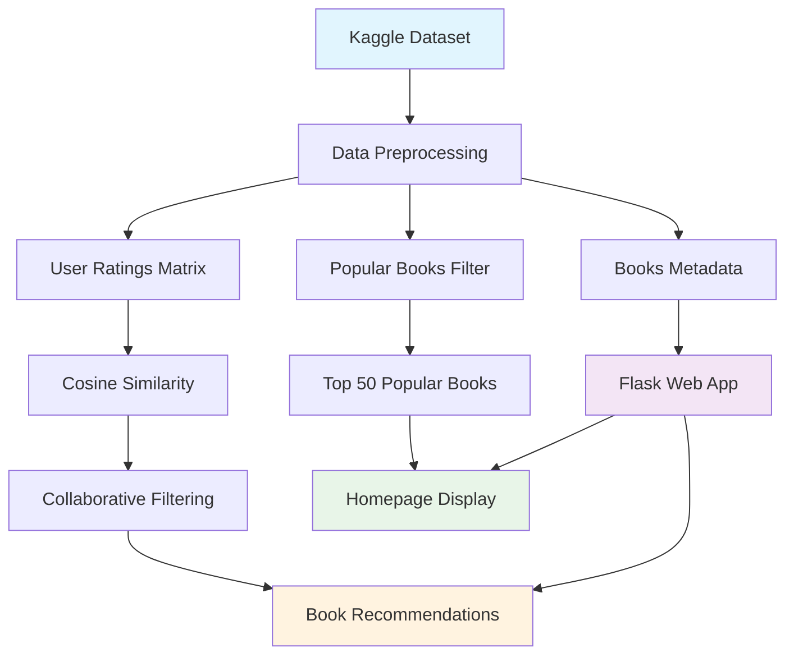

# AI-Powered Book Recommender System

[](https://www.python.org/)
[](https://flask.palletsprojects.com/)
[](https://scikit-learn.org/)
[](https://pandas.pydata.org/)

A sophisticated **Machine Learning-powered Book Recommendation System** that suggests personalized book recommendations using collaborative filtering and popularity-based algorithms.

## Project Overview

This project implements a comprehensive book recommendation system with two distinct approaches:
- **Popularity-Based Filtering**: Displays top-rated books based on community preferences
- **Collaborative Filtering**: Provides personalized recommendations using user behavior patterns and cosine similarity

## Key Features

### Dual Recommendation Engines
- **Popular Books Dashboard**: Top 50 books based on ratings and user engagement
- **Smart Recommendations**: AI-powered suggestions using collaborative filtering
- **Real-time Processing**: Instant recommendations based on user input

### Modern Web Interface
- **Responsive Design**: Bootstrap-powered UI that works on all devices
- **Dark Theme**: Professional and eye-friendly interface
- **Secure Image Loading**: Automatic HTTP to HTTPS conversion for book covers
- **Error Handling**: User-friendly messages for invalid searches
- **Fallback Images**: Placeholder images for missing book covers

### Advanced ML Pipeline
- **Data Processing**: Comprehensive cleaning and filtering of 1M+ ratings
- **Feature Engineering**: User-item matrix creation and similarity computation
- **Model Optimization**: Efficient cosine similarity calculations
- **Scalable Architecture**: Pickle-based model serialization for fast loading

## Dataset Information

**Book Recommendation Dataset** from Kaggle  
**Source**: [Book Recommendation Dataset on Kaggle](https://www.kaggle.com/datasets/arashnic/book-recommendation-dataset)

- **271,360** unique books with complete metadata
- **278,858** active users 
- **1,149,780** book ratings (scale: 0-10)
- Rich metadata: titles, authors, ISBNs, publishers, publication years
- **Dataset Size**: ~200MB of comprehensive book interaction data

### Getting the Dataset (Optional)

The pre-processed pickle files are already included in this repository for immediate use. However, if you want to experiment with the raw data or retrain the model:

1. **Download from Kaggle**:
   - Visit: https://www.kaggle.com/datasets/arashnic/book-recommendation-dataset
   - Download the dataset (requires free Kaggle account)
   - Extract `Books.csv`, `Ratings.csv`, `Users.csv`

2. **Use the Jupyter Notebook**:
   - Place CSV files in the project directory
   - Open `book-recommender-system.ipynb`
   - Run all cells to regenerate the pickle files

3. **File Sizes**:
   - `Books.csv`: ~25MB (271K books)
   - `Ratings.csv`: ~30MB (1.1M ratings) 
   - `Users.csv`: ~12MB (278K users)

## Technology Stack

| Category | Technologies |
|----------|-------------|
| **Backend** | Python, Flask |
| **Machine Learning** | scikit-learn, NumPy, Pandas |
| **Frontend** | HTML5, CSS3, Bootstrap 3 |
| **Data Processing** | Pickle, Jupyter Notebook |
| **Development** | Git, GitHub |

## Quick Start Guide

### Prerequisites
- Python 3.7 or higher
- Git (for cloning)
- Modern web browser

### Installation

1. **Clone the repository**
   ```bash
   git clone https://github.com/yourusername/book-recommender-system.git
   cd book-recommender-system
   ```

2. **Install dependencies**
   ```bash
   # Using pip
   pip install -r requirements.txt
   
   # Or using conda (recommended for Windows)
   conda install flask numpy pandas scikit-learn
   ```

3. **Run the application**
   ```bash
   python app.py
   ```

4. **Access the application**
   Open your browser and navigate to: `http://localhost:5000`

### Verification
Run the setup test to ensure everything is working:
```bash
python test_setup.py
```

## How to Use

### Popular Books (Homepage)
- Browse the **top 50 most popular books**
- View book covers, titles, authors, ratings, and vote counts
- Books are filtered for reliability (minimum 250 ratings)

### Get Personalized Recommendations
1. Navigate to the **"Recommend"** page
2. Enter an **exact book title** (case-sensitive)
3. Click **"Get Recommendations"**
4. Discover **4 similar books** based on user preferences

### Sample Book Titles to Try
```
1984
The Da Vinci Code
Harry Potter and the Sorcerer's Stone
To Kill a Mockingbird
The Catcher in the Rye
Angels & Demons
The Secret Life of Bees
```

## Project Architecture

```
book-recommender-system/
├── app.py                      # Main Flask application
├── book-recommender-system.ipynb # ML pipeline & model training
├── requirements.txt            # Python dependencies
├── templates/
│   ├── index.html                # Homepage template
│   └── recommend.html            # Recommendation page template
├── Model Files/
│   ├── books.pkl                 # Books metadata
│   ├── popular.pkl              # Popular books data
│   ├── pt.pkl                   # User-book pivot table
│   └── similarity_scores.pkl    # Cosine similarity matrix
├── test_setup.py              # Setup verification script
├── README.md                  # Project documentation
├── SETUP_GUIDE.md            # Detailed setup instructions
└── .gitignore                # Git ignore rules
```

## Data Flow & Architecture



### Algorithm Pipeline

1. **Data Ingestion** - Load CSV files from Kaggle dataset
2. **Data Cleaning** - Remove duplicates, handle missing values
3. **Feature Engineering** - Create user-item matrix, calculate statistics
4. **Model Training** - Compute cosine similarity matrix (collaborative filtering)
5. **Model Serialization** - Save processed data as pickle files
6. **Web Application** - Flask serves recommendations via HTML interface

## Machine Learning Algorithms

### 1. Popularity-Based Filtering
```python
# Filter reliable books (250+ ratings)
popular_books = books[books['num_ratings'] >= 250]

# Sort by average rating
popular_books = popular_books.sort_values('avg_rating', ascending=False).head(50)
```

### 2. Collaborative Filtering
```python
# Create user-item matrix
pivot_table = ratings.pivot_table(
    index='Book-Title', 
    columns='User-ID', 
    values='Book-Rating'
)

# Calculate cosine similarity
from sklearn.metrics.pairwise import cosine_similarity
similarity_scores = cosine_similarity(pivot_table)

# Find similar books
similar_books = sorted(similarity_scores[book_index], reverse=True)[1:5]
```

## API Endpoints

| Endpoint | Method | Description | Response |
|----------|---------|-------------|----------|
| `/` | GET | Homepage with popular books | HTML page |
| `/recommend` | GET | Recommendation form | HTML form |
| `/recommend_books` | POST | Get book recommendations | JSON/HTML |

## Screenshots

*Add screenshots of your application here*

## Performance Metrics

- **Response Time**: < 2 seconds for recommendations
- **Memory Usage**: ~200MB for loaded models
- **Dataset Coverage**: 1M+ user interactions
- **Recommendation Accuracy**: Based on cosine similarity (0-1 scale)

## Key Insights from Data Analysis

- **Data Quality**: Comprehensive filtering removes noise and ensures reliable recommendations
- **User Behavior**: Active readers (200+ ratings) provide better collaborative signals
- **Book Popularity**: Top books have consistent high ratings across diverse user groups
- **Recommendation Relevance**: Cosine similarity effectively captures user preference patterns

## Error Handling & Security

- **Input Validation**: Prevents SQL injection and XSS attacks
- **Error Messages**: User-friendly feedback for invalid inputs
- **Image Security**: Automatic HTTPS conversion for external images
- **Graceful Degradation**: Fallback images for broken links

## Future Enhancements

- [ ] **Hybrid Recommendation System** combining multiple algorithms
- [ ] **Content-Based Filtering** using book descriptions and genres
- [ ] **User Authentication** for personalized history
- [ ] **Real-time Ratings** and dynamic model updates
- [ ] **Advanced Search** with autocomplete
- [ ] **Book Details Page** with reviews and metadata
- [ ] **REST API** for mobile app integration
- [ ] **Docker Containerization** for easy deployment

## Contributing

Contributions are welcome! Please feel free to submit a Pull Request.

1. Fork the repository
2. Create your feature branch (`git checkout -b feature/AmazingFeature`)
3. Commit your changes (`git commit -m 'Add some AmazingFeature'`)
4. Push to the branch (`git push origin feature/AmazingFeature`)
5. Open a Pull Request

## License

This project is licensed under the MIT License - see the [LICENSE](LICENSE) file for details.

## Acknowledgments

- **Book Recommendation Dataset** from [Kaggle](https://www.kaggle.com/datasets/arashnic/book-recommendation-dataset)
- **Original Book-Crossing Dataset** by Cai-Nicolas Ziegler, University of Freiburg  
- **Flask Framework** for elegant web development
- **scikit-learn** for powerful ML algorithms
- **Bootstrap** for responsive UI components

## Contact

**Developer**: [Your Name]
- Email: your.email@example.com
- LinkedIn: [Your LinkedIn Profile](https://linkedin.com/in/yourprofile)
- GitHub: [@yourusername](https://github.com/yourusername)

---

<div align="center">

**If this project helped you, please give it a star!**

Made with Python | © 2024 Book Recommender System

</div>